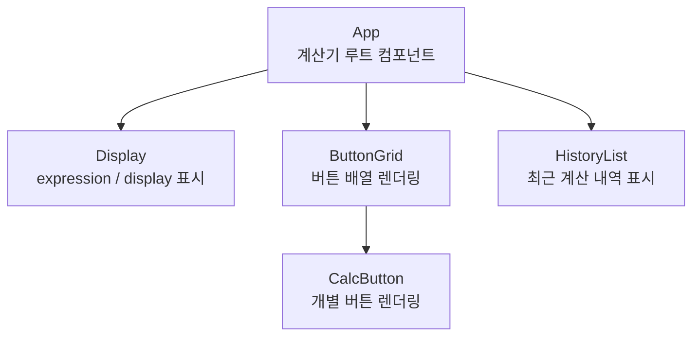
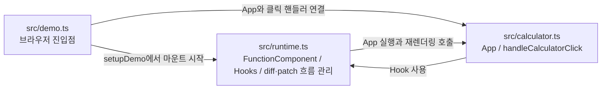

# mini-react

`mini-react`는 React의 핵심 개념을 작은 규모로 직접 구현해 보는 프로젝트입니다.
Virtual DOM 생성, DOM -> VDOM 변환, Diff 알고리즘, 그리고 간단한 함수형 컴포넌트 런타임을 직접 구성합니다.

## main 브랜치 기준 핵심 파일

### `src/calculator.ts`

계산기 데모의 상태, 이벤트 처리, 화면 구성을 담당하는 파일입니다.

- `CalculatorState`, `ButtonSpec`, `HistoryEntry` 타입을 정의해 계산기 상태와 UI 구성을 명확하게 표현합니다.
- `applyDigitToState`, `applyOperatorToState`, `applyEqualToState`, `applyClearToState` 같은 순수 함수를 통해 계산기 상태 전이 로직을 분리합니다.
- `App`, `Display`, `ButtonGrid`, `HistoryList`, `CalcButton` 컴포넌트가 Virtual DOM 노드를 만들어 화면 구조를 구성합니다.
- `useState`, `useMemo`, `useEffect`를 사용해 display, 최근 계산 내역, 문서 제목, `localStorage` 동기화를 관리합니다.
- `handleCalculatorClick`는 루트에 등록된 클릭 이벤트를 위임받아 버튼 액션에 따라 상태를 갱신합니다.

#### 계산기 컴포넌트 관계

#### Hook 사용 위치

- `useState`는 `state / setState`로 계산기 상태를 관리하고, `history / setHistory`로 최근 계산 내역을 관리합니다.
- `useMemo`는 `persistedSnapshot` 초기값을 한 번 읽어 복원하고, `recentHistory`를 `history`에서 파생해 최근 5개를 역순으로 만듭니다.
- `useEffect`는 `document.title`을 `state.display`와 동기화하고, `display`와 `history`를 `localStorage`에 저장합니다.

즉, `calculator.ts`는 "무엇을 보여줄지"와 "버튼을 눌렀을 때 상태가 어떻게 바뀌는지"를 담당합니다.

### `src/demo.ts`

브라우저에서 계산기 데모를 실제로 시작시키는 진입점입니다.

- `DOMContentLoaded` 시점에 `setupDemo()`를 호출합니다.
- `#app` 루트 엘리먼트를 찾아 계산기를 mount합니다.
- 루트에 클릭 이벤트를 한 번만 연결해서 `handleCalculatorClick`으로 전달합니다.
- `WeakSet`으로 이미 mount된 루트를 추적해 중복 초기화를 방지합니다.

즉, `demo.ts`는 "언제, 어디에, 어떤 컴포넌트를 붙일지"를 담당합니다.

### `src/runtime.ts`

함수형 컴포넌트와 Hook이 동작하기 위한 최소 런타임입니다.

- `FunctionComponent` 클래스가 렌더 함수 실행, 이전 VDOM 보관, `diffVNode` 호출, patch 적용, effect 실행 시점을 관리합니다.
- `currentComponent`와 `hookIndex`를 이용해 현재 렌더 중인 컴포넌트의 Hook 슬롯을 추적합니다.
- `useState`는 상태 값과 setter를 저장하고, setter 호출 시 `update()`를 실행해 다시 렌더링합니다.
- `useMemo`는 dependency 배열을 비교해 필요한 경우에만 값을 다시 계산합니다.
- `useEffect`는 렌더 중 바로 실행하지 않고 DOM 반영 이후 effect queue에서 실행되도록 처리합니다.

즉, `runtime.ts`는 "상태가 바뀌었을 때 어떤 순서로 다시 렌더링할지"를 담당합니다.

## 세 파일의 연결 흐름

1. `demo.ts`가 브라우저의 `#app` 루트에서 계산기 앱을 시작합니다.
2. `runtime.ts`의 `FunctionComponent`가 `calculator.ts`의 `App`을 실행해 Virtual DOM을 생성합니다.
3. 상태가 바뀌면 `runtime.ts`가 이전 VDOM과 새 VDOM을 비교하고 patch를 적용합니다.
4. `calculator.ts`는 갱신된 상태를 바탕으로 새로운 계산기 화면과 계산 내역을 다시 렌더링합니다.

### 테스트 구성

- `test/calculator.test.mjs`는 계산기 순수 함수와 `Display`, `ButtonGrid`, `HistoryList`, `CalcButton` 같은 UI 컴포넌트의 VNode 구조를 검증합니다.
- `test/demo.test.mjs`는 `setupDemo()` 기준으로 localStorage 복원, 잘못된 저장값 fallback, 최근 5개 history 유지, 숫자 입력과 계산 결과 반영까지 브라우저 흐름을 검증합니다.
- `test/function-component.test.mjs`는 `FunctionComponent`의 mount/update 동작과 재렌더 시 DOM node identity 유지 여부를 검증합니다.
- `test/runtime-hooks.test.mjs`는 hook slot 배정, `useEffect` 실행 조건과 순서, `useMemo` 캐시/재계산 규칙을 검증합니다.
- `test/use-state.test.mjs`는 `useState`의 초기값 반환, setter 재사용, 렌더 바깥 호출 에러를 검증합니다.

테스트는 TypeScript 빌드 후 계산기, demo, Hook 런타임, Diff/patch 동작을 함께 검증합니다.
