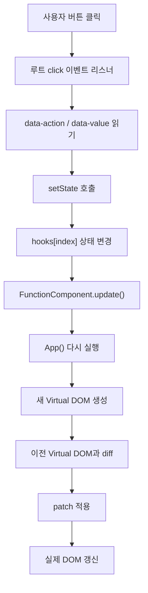
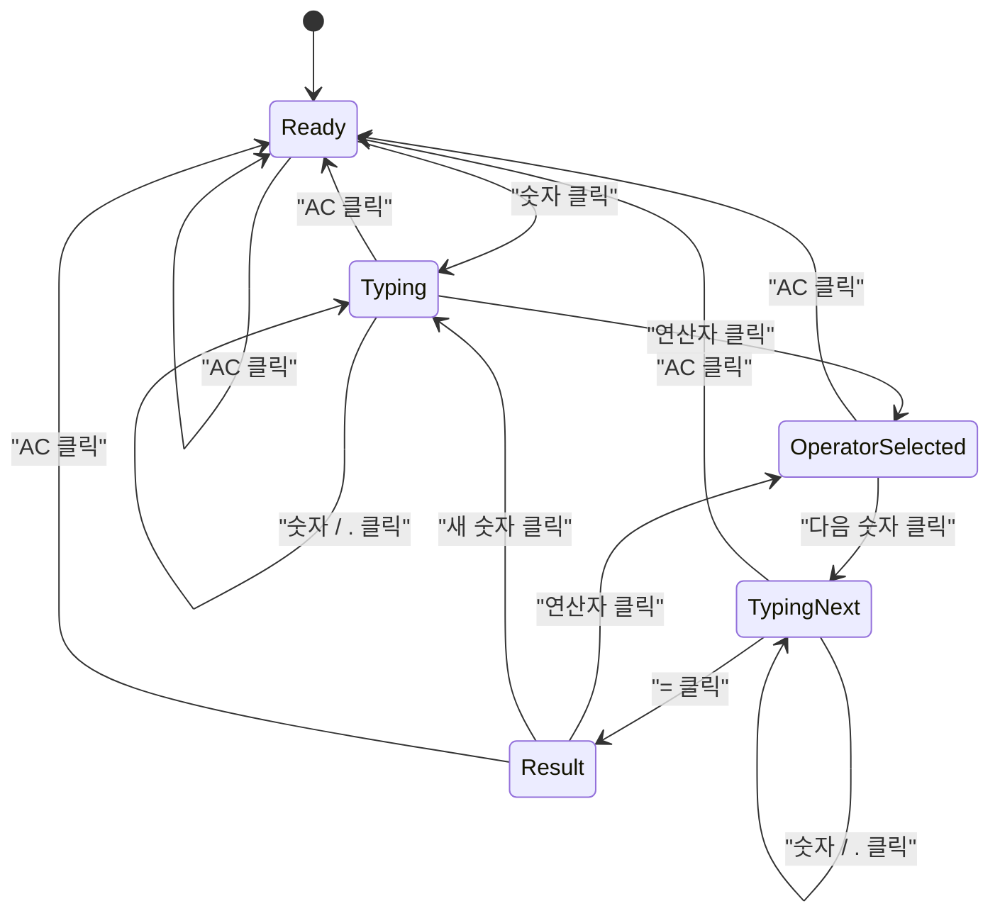
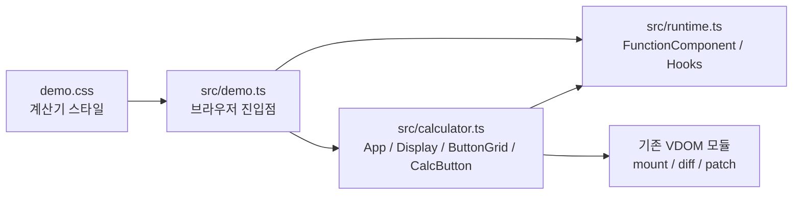

# Week 5 계산기 구현 가이드

## 목표

이번 문서는 Week 5 요구사항을 만족하는 시연용 웹사이트를
`계산기` 주제로 가장 단순하게 구현하는 방법을 정리한 가이드입니다.

핵심 원칙은 아래와 같습니다.

- 상태는 루트 컴포넌트 `App` 에서만 관리합니다.
- 자식 컴포넌트는 `props` 만 받는 순수 함수로 만듭니다.
- 상태가 바뀌면 `App` 을 다시 실행합니다.
- 다시 만든 Virtual DOM을 이전 Virtual DOM과 비교한 뒤 변경된 부분만 patch 합니다.

## 전체 구조 한눈에 보기

1. `App` 이 계산기 전체 상태를 가지고 있습니다.
2. `App()` 이 현재 상태를 바탕으로 Virtual DOM을 반환합니다.
3. 사용자가 버튼을 클릭합니다.
4. 클릭 이벤트가 `setState()` 를 호출합니다.
5. `FunctionComponent.update()` 가 실행됩니다.
6. 새로운 Virtual DOM을 만듭니다.
7. 이전 Virtual DOM과 `diff` 합니다.
8. 바뀐 부분만 실제 DOM에 반영합니다.

즉, 계산기 화면은 "상태를 보여주는 결과"라고 생각하면 이해하기 쉽습니다.

### 렌더링 흐름 다이어그램



## 상태 흐름

계산기는 처음부터 복잡하게 만들 필요가 없습니다.
아래 정도의 상태만 있어도 충분합니다.

```ts
type Operator = '+' | '-' | '*' | '/' | null;

type CalculatorState = {
  display: string;
  storedValue: number | null;
  operator: Operator;
  waitingForNextValue: boolean;
};
```

각 값의 역할은 아래와 같습니다.

- `display`: 현재 화면에 보이는 숫자 문자열
- `storedValue`: 연산자 버튼을 누르기 전 저장해 둔 숫자
- `operator`: 현재 선택된 연산자
- `waitingForNextValue`: 다음 숫자를 새로 입력받아야 하는지 여부

### 상태 변화 예시

예를 들어 `12 + 7 =` 을 누르면 흐름은 아래와 같습니다.

1. 처음 상태는 `display = "0"` 입니다.
2. `1` 클릭 후 `display = "1"` 이 됩니다.
3. `2` 클릭 후 `display = "12"` 가 됩니다.
4. `+` 클릭 후 `storedValue = 12`, `operator = "+"`, `waitingForNextValue = true` 가 됩니다.
5. `7` 클릭 후 `display = "7"`, `waitingForNextValue = false` 가 됩니다.
6. `=` 클릭 후 계산 결과 `19` 가 `display` 에 들어갑니다.

### 상태 전이 다이어그램



## 컴포넌트 구조

이번 과제 제약에 맞추면 아래 구조가 가장 단순합니다.

- `App`
  - 루트 컴포넌트
  - `useState`, `useEffect`, `useMemo` 사용
  - 계산기 전체 상태 보유
- `Display`
  - 현재 숫자와 수식 표시
  - `props` 만 사용
- `ButtonGrid`
  - 버튼 목록 렌더링
  - `props` 만 사용
- `CalcButton`
  - 버튼 하나 렌더링
  - `props` 만 사용

즉, state는 오직 `App` 에만 있고, 나머지는 화면 출력만 담당합니다.

## 컴포넌트 책임 정리

### App

`App` 은 아래 일을 담당합니다.

- 계산기 상태 저장
- 현재 상태를 기반으로 화면 구성
- 자식 컴포넌트에 props 전달
- `useEffect` 로 부수효과 실행
- `useMemo` 로 파생 값 계산

예를 들어 `App` 안에서는 아래 값들을 만들 수 있습니다.

- `display`
- 현재 수식 문자열
- 버튼에 필요한 데이터

### Display

`Display` 는 아래만 하면 됩니다.

- 위쪽에 현재 수식 문자열 표시
- 아래쪽에 현재 숫자 표시

즉, `Display` 는 받은 `props` 를 그대로 그리는 순수 함수입니다.

### ButtonGrid

`ButtonGrid` 는 버튼 배치를 담당합니다.

- 숫자 버튼
- 연산자 버튼
- `=`
- `AC`
- `.`

이 컴포넌트는 버튼 목록을 묶어서 보여주는 역할만 합니다.

### CalcButton

`CalcButton` 은 버튼 하나를 렌더링합니다.

- 버튼 라벨
- `data-action`
- `data-value`

이 프로젝트에서는 버튼에 함수형 `onClick` 을 직접 넣기보다,
`data-*` 속성으로 버튼 의미를 전달하는 방식이 가장 단순합니다.

## 이벤트 처리 방식

현재 프로젝트 구조에서는 이벤트를 아래처럼 처리하는 방법이 가장 쉽습니다.

1. 버튼마다 `data-action`, `data-value` 를 넣습니다.
2. 루트 DOM에 `click` 이벤트 리스너를 한 번만 등록합니다.
3. 클릭된 버튼의 `data-action` 을 읽습니다.
4. 해당 action에 맞게 `setState()` 를 호출합니다.

예를 들면 버튼 Virtual DOM은 아래처럼 만들 수 있습니다.

```ts
createElementNode('button', {
  props: {
    type: 'button',
    'data-action': 'digit',
    'data-value': '7',
  },
  children: [createTextNode('7')],
});
```

이벤트 처리 코드는 아래처럼 생각하면 됩니다.

```ts
root.addEventListener('click', (event) => {
  const target = event.target as HTMLElement;
  const button = target.closest('button[data-action]');

  if (button === null) {
    return;
  }

  const action = button.getAttribute('data-action');
  const value = button.getAttribute('data-value') ?? '';

  // action에 따라 setState 호출
});
```

이 방식은 구현이 단순하고,
현재 `props` 구조를 크게 바꾸지 않아도 된다는 장점이 있습니다.

## Hooks 적용 방법

### useState

가장 먼저 구현해야 하는 Hook 입니다.

`App` 에서 계산기 상태를 아래처럼 관리하면 됩니다.

```ts
const [state, setState] = useState(initialState);
```

버튼 클릭 시에는 `setState()` 로 새 상태를 만들고,
그 안에서 `component.update()` 가 실행되도록 연결합니다.

### useEffect

`useEffect` 는 렌더링이 끝난 뒤 실행할 작업에 사용하면 됩니다.

계산기 예시로는 아래 정도가 적당합니다.

- `document.title` 을 현재 숫자에 맞게 갱신

예:

```ts
useEffect(() => {
  document.title = `Calculator: ${state.display}`;
}, [state.display]);
```

### useMemo

`useMemo` 는 파생 값을 저장할 때 사용하면 됩니다.

계산기에서는 아래 값이 적당합니다.

- 화면 위쪽에 보여줄 수식 문자열

예:

```ts
const expression = useMemo(() => {
  if (state.storedValue === null || state.operator === null) {
    return 'Ready';
  }

  return `${state.storedValue} ${state.operator} ${state.display}`;
}, [state.storedValue, state.operator, state.display]);
```

## 파일 분리 추천

아래처럼 나누면 이해하기 쉽고 역할도 분명합니다.

- `src/runtime.ts`
  - `FunctionComponent`
  - `useState`
  - `useEffect`
  - `useMemo`
- `src/calculator.ts`
  - `App`
  - `Display`
  - `ButtonGrid`
  - `CalcButton`
  - 계산기 상태 변경 함수
- `src/demo.ts`
  - 브라우저 진입점
  - 루트 DOM 선택
  - 계산기 시작

필요하면 스타일은 아래처럼 따로 둘 수 있습니다.

- `demo.css`
  - 계산기 UI 스타일

### 파일 구조 다이어그램



## 구현 순서

가장 이해하기 쉬운 순서는 아래와 같습니다.

1. `FunctionComponent` 클래스를 만듭니다.
2. `hooks` 배열과 `hookIndex` 흐름을 연결합니다.
3. `useState` 를 구현합니다.
4. `App` 하나만 두고 숫자 버튼 클릭 시 화면이 바뀌는지 먼저 확인합니다.
5. `+`, `-`, `*`, `/` 연산을 추가합니다.
6. `=` 버튼과 `AC` 버튼을 추가합니다.
7. `Display`, `ButtonGrid`, `CalcButton` 으로 화면을 분리합니다.
8. `useEffect` 를 추가해 `document.title` 을 갱신합니다.
9. `useMemo` 를 추가해 수식 문자열을 계산합니다.
10. 마지막으로 CSS를 다듬고 전체 동작을 확인합니다.

## 최소 성공 기준

아래 항목이 되면 계산기 시연용 웹사이트로 충분합니다.

- 숫자 버튼 클릭 시 화면 숫자가 바뀐다.
- 연산자 버튼 클릭 후 다음 숫자를 입력할 수 있다.
- `=` 버튼을 누르면 계산 결과가 나온다.
- `AC` 버튼을 누르면 초기화된다.
- 상태는 루트 컴포넌트 `App` 에만 있다.
- 자식 컴포넌트는 `props` 만 사용한다.
- 내부적으로 `diff + patch` 로 화면이 갱신된다.
- `useEffect`, `useMemo` 사용 예시가 들어간다.

## 구현할 때 욕심내지 않아도 되는 것

처음부터 아래까지 구현할 필요는 없습니다.

- 괄호 계산
- 연속 연산 최적화
- 키보드 입력 지원
- 복잡한 에러 처리
- 이벤트 props 시스템
- 여러 컴포넌트에서 Hook 사용

이번 과제에서는 "루트 state + hooks + diff/patch + 사용자 상호작용" 이 보이면 충분합니다.

## 한 줄 요약

계산기 시연용 웹사이트는
`루트 App이 상태를 관리하고, 자식 컴포넌트는 props만 받아 화면을 그리며, 버튼 클릭 때 setState로 다시 렌더링하는 구조`
로 만들면 가장 단순하고 요구사항에도 잘 맞습니다.
